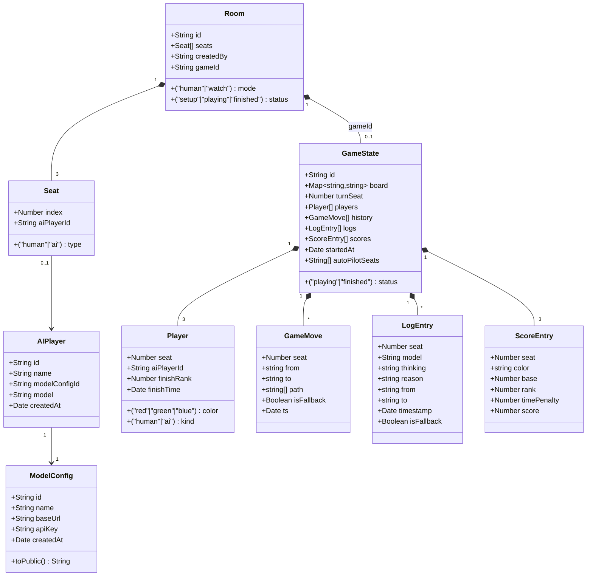
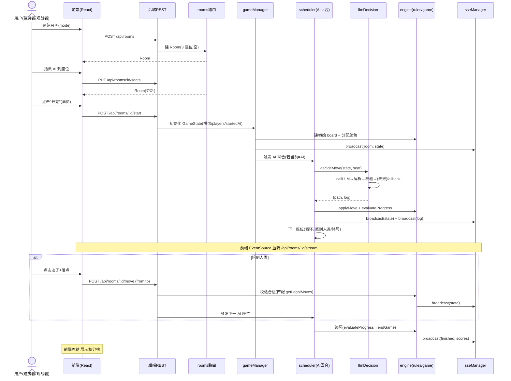

# 系统架构设计 + 任务分解（AI 中国跳棋 Web 应用）

**作者**：高见远（Gao）· 架构师
**日期**：2025-08-15
**依据**：`docs/prd.md` + 主理人拍板的 5 项决策 + 第 0 步调研结论（从零搭建；棋盘几何参考 zym9863/chinese-checkers 立方坐标方案，仅作算法参考，自研实现）

---

## 1. 实现方案与框架选型

### 1.1 后端

| 项 | 选型 | 论证 |
|---|---|---|
| 运行时 | **Node.js 22（ESM，纯 JavaScript）** | 主理人拍板用 JS 以减少构建/运行风险。Node 22 自带全局 `fetch` 与 `crypto.randomUUID`，无需 `node-fetch` / `nanoid`。`package.json` 设 `"type":"module"`，直接 `node src/index.js` 运行，无编译步骤。 |
| Web 框架 | **Express 5** | 轻量、生态成熟；REST 路由 + SSE 流均可直接用原生 `res` 实现，零额外实时通信依赖。 |
| 跨域 | **cors** | 前端独立 dev server（Vite 默认 5173）需跨域访问后端（默认 3001）。 |
| 持久化 | **项目内 JSON 文件**（`server/data/*.json`，零原生依赖） | 满足"依赖全在 project 内"。存放：模型配置、AI 玩家、房间元数据（低频写）。**活跃对局 GameState 存内存 `Map`**（每步高频变更，避免每次写盘），终局结果追加到 `games.json`（历史，对应 P2-2）。 |
| 实时通信 | **SSE（Server-Sent Events）** | 服务端→客户端单向推送（棋盘状态、AI 思考日志、决策理由、终局）。Express 直接 `res.write()` 流式推送，无需 `ws` 依赖，比 WebSocket 更稳、更易跑通。客户端→服务端走 REST。 |
| LLM 调用 | **原生 `fetch` + OpenAI 兼容 `/v1/chat/completions`** | `AbortController` 实现 30s 超时；同一 `baseURL` 调用间加 ≥800ms 最小间隔防限流（决策 5）。 |

**不做的事**：不引入 TypeScript 编译链、不引入 ORM/数据库、不引入 WebSocket 库。

### 1.2 前端

| 项 | 选型 | 论证 |
|---|---|---|
| 构建 | **Vite 5 + React 18** | Vite 直接编译 `.jsx`，免类型检查，启动快。 |
| UI | **MUI v5 + @emotion** | PRD 指定；提供现成组件（表格、表单、卡片、抽屉）。 |
| 样式 | **Tailwind CSS 3 + PostCSS** | 响应式断点（≤768px 移动端适配，P2-1）与快速布局。 |
| 语言 | **JSX（纯 JS）** | 与后端一致，免类型检查，降低风险。 |
| 路由 | **react-router-dom v6** | 4 类页面（模型配置 / AI 玩家 / 房间 / 对局牌桌）。 |
| 状态 | **React Context + 自定义 hooks** | 轻量全局态（当前房间、SSE 连接）；棋盘/日志走组件内 `useState`，避免引入 Redux。 |

### 1.3 架构模式

- 后端分层：**routes（HTTP 契约）→ services（LLM/决策编排）→ engine（纯函数规则，无 I/O，易单测）→ store（JSON 持久化）→ realtime（SSE）→ scheduler（AI 回合驱动）**。规则引擎为纯函数模块，便于 P0-3 单元测试。
- 前端分层：**pages（路由页）→ components（按 4 类业务 + 棋盘/日志/座位卡）→ api（REST/SSE 封装）→ hooks/context**。

---

## 2. 完整文件列表与相对路径

### 2.1 后端 `server/`

```
server/
├── package.json                 # ESM 配置、依赖、start 脚本
├── .env.example                 # PORT、前端地址等（不含 Key，Key 走 JSON 持久化）
└── src/
    ├── index.js                 # 入口：创建 Express、挂载路由、启动监听
    ├── config.js                # 端口、DATA_DIR、SSE 心跳间隔、LLM 超时/最小间隔常量
    ├── constants.js             # 颜色 RED/GREEN/BLUE、6 方向向量、SSE 事件名、错误码
    ├── store.js                 # JSON 读写层：loadCollection/saveCollection（modelConfigs/aiPlayers/rooms/games）
    ├── engine/
    │   ├── board.js             # 立方坐标体系：isValidCoord、生成 121 坐标、角归属判定、home/target 映射、坐标↔像素
    │   ├── rules.js             # getLegalMoves / findJumpChains / applyMove / hasAnyLegalMove / countInTarget
    │   └── game.js              # 创建 GameState、座位→颜色→home/target 分配、回合流转、胜负与积分结算
    ├── services/
    │   ├── modelProvider.js     # callLLM / listModels(代理) / testConnection
    │   ├── promptBuilder.js     # buildPrompt(state, seat)：棋盘序列化 + 约束 + 合法走法提示
    │   └── llmDecision.js       # decideMove：调 LLM→解析→校验→严格重试 1 次→fallback；连续失败计数/auto-pilot
    ├── realtime/
    │   └── sseManager.js        # SSE 连接注册表 + broadcast(roomId, event, data) + 心跳
    ├── scheduler.js             # AI 回合定时器：轮到 AI 座位则触发 decideMove→apply→广播→下一座位
    └── routes/
        ├── modelConfigs.js      # 模型配置 CRUD + /:id/models + /:id/test
        ├── aiPlayers.js         # AI 玩家 CRUD（删除占用保护）
        └── rooms.js             # 房间 CRUD + 座位指派 + start + /:id/stream(SSE) + /:id/move
└── data/                        # 运行时由 store 自动创建（gitignore 可选）
    ├── modelConfigs.json
    ├── aiPlayers.json
    ├── rooms.json
    └── games.json               # 终局历史归档
```

### 2.2 前端 `client/`

```
client/
├── package.json
├── vite.config.js               # React 插件 + 代理 /api、/stream 到后端 3001（避免 CORS 调试）
├── tailwind.config.js           # content 扫描 src；自定义断点
├── postcss.config.js
├── index.html                   # 挂载点 + 标题
└── src/
    ├── main.jsx                 # React 入口
    ├── App.jsx                  # 路由 + Layout 包裹
    ├── theme.js                 # MUI 主题（含三方配色）
    ├── api/
    │   ├── client.js            # REST fetch 封装（统一错误处理、baseURL）
    │   └── sse.js               # 打开 /api/rooms/:id/stream，按事件名分发回调
    ├── context/
    │   └── AppContext.jsx       # 全局：当前 roomId、toast
    ├── hooks/
    │   ├── useSSE.js            # 订阅房间 SSE，维护 board/logs/finished 状态
    │   └── useModels.js         # 拉取某模型配置的模型列表（表单用）
    ├── utils/
    │   ├── colors.js            # 颜色常量与中文名映射（与后端一致）
    │   └── boardGeometry.js     # 复用 board.js 的像素映射，计算 121 孔位屏幕坐标
    ├── components/
    │   ├── Layout/
    │   │   └── NavBar.jsx       # 顶部导航（模型配置/AI 玩家/房间/对局）
    │   ├── ModelConfig/
    │   │   ├── ModelConfigList.jsx   # 列表（名称/BaseURL/模型数/操作）
    │   │   └── ModelConfigForm.jsx   # 新增/编辑表单 + 拉取模型 + 连通性测试
    │   ├── AIPlayer/
    │   │   ├── AIPlayerList.jsx      # 列表（名称/配置/模型/操作）
    │   │   └── AIPlayerForm.jsx      # 新增/编辑（选配置 + 选模型）
    │   ├── Room/
    │   │   ├── RoomList.jsx          # 房间列表 + 创建入口
    │   │   ├── RoomCreate.jsx        # 模式切换 + 创建
    │   │   └── SeatPanel.jsx         # 座位指派面板（下拉绑 AI，满员指示）
    │   └── Game/
    │       ├── Board.jsx              # 六角星棋盘渲染 + 点击选子/落子（桌面+移动）
    │       ├── SeatInfoCard.jsx      # 座位/玩家卡（名称、颜色、积分、状态、托管标记）
    │       ├── DecisionLog.jsx       # 决策理由日志侧栏（可滚动、可折叠抽屉）
    │       └── ScoreBoard.jsx        # 积分榜
    └── pages/
        ├── ModelConfigPage.jsx       # 模型配置页
        ├── AIPlayerPage.jsx          # AI 玩家页
        ├── RoomPage.jsx              # 房间页（列表 + 创建 + 指派 + 开始）
        └── GamePage.jsx              # 对局牌桌页（Board + SeatInfoCard + DecisionLog + ScoreBoard，响应式三栏/抽屉）
```

---

## 3. 数据模型与接口

### 3.1 数据模型（类图）



### 3.2 关键模型字段说明

- **ModelConfig**(见 PRD)：`apiKey` 绝不出现在任何响应里，`toPublic()` 剔除它，列表/详情只返回 `modelCount`。
- **AIPlayer**：`model` 为绑定到该配置下的具体模型名（来自 `/models` 列表）。
- **Room.seats**：固定长度 3 的数组。human 模式：`seats[0].type='human'`、其余 `ai`；watch 模式：三者皆 `ai`。满员 = 所有 `ai` 座位都有 `aiPlayerId`（human 座位天然满）。
- **GameState.board**：`{ "q,r,s": "red"|"green"|"blue" | null }`，**全 121 键**（含 null），键格式 `"q,r,s"` 且 `q+r+s=0`。
- **GameState.players**：3 项，对应 3 座位；`color` 由座位顺序固定（见 §4.4、§5.4）。

### 3.3 REST 契约

**模型配置（`/api/model-configs`）**

| 方法 | 路径 | 请求体 | 响应 |
|---|---|---|---|
| GET | `/api/model-configs` | — | `{code:0,data:[{id,name,baseUrl,modelCount,createdAt}]}` |
| POST | `/api/model-configs` | `{name,baseUrl,apiKey}` | `{code:0,data:ModelConfig(公开)}` |
| GET | `/api/model-configs/:id` | — | `{code:0,data:ModelConfig(公开)}` |
| PUT | `/api/model-configs/:id` | `{name?,baseUrl?,apiKey?}` | `{code:0,data:ModelConfig(公开)}` |
| DELETE | `/api/model-configs/:id` | — | `{code:0,data:null}`（409 若该配置被 AI 玩家占用） |
| GET | `/api/model-configs/:id/models` | — | `{code:0,data:["gpt-4o","..."]}`（后端代理 `GET {baseUrl}/models`） |
| POST | `/api/model-configs/:id/test` | — | `{code:0,data:{ok:true,latencyMs:123}}` 或 `{code:0,data:{ok:false,message:"..."}}` |

**AI 玩家（`/api/ai-players`）**

| 方法 | 路径 | 请求体 | 响应 |
|---|---|---|---|
| GET | `/api/ai-players` | — | `{code:0,data:[AIPlayer]}` |
| POST | `/api/ai-players` | `{name,modelConfigId,model}` | `{code:0,data:AIPlayer}` |
| GET | `/api/ai-players/:id` | — | `{code:0,data:AIPlayer}` |
| PUT | `/api/ai-players/:id` | `{name?,modelConfigId?,model?}` | `{code:0,data:AIPlayer}` |
| DELETE | `/api/ai-players/:id` | — | `{code:0,data:null}`（409 若该玩家在某个房间座位占用中） |

**房间（`/api/rooms`）**

| 方法 | 路径 | 请求体 | 响应 / 说明 |
|---|---|---|---|
| GET | `/api/rooms` | — | `{code:0,data:[Room(含 status/gameId，不含完整 board)]}` |
| POST | `/api/rooms` | `{mode:"human"\|"watch", createdBy:string}` | `{code:0,data:Room}`。human：seats[0]=human，1/2=ai 空；watch：3 个 ai 空座位。 |
| GET | `/api/rooms/:id` | — | `{code:0,data:Room(+GameState 若已开始)}` |
| PUT | `/api/rooms/:id/seats` | `{seatIndex:0\|1\|2, aiPlayerId:string\|null}` | `{code:0,data:Room}`。仅对 `ai` 座位有效；`null`=清空。 |
| POST | `/api/rooms/:id/start` | — | `{code:0,data:GameState}`。校验满员，否则 409。初始化棋盘、`startedAt`、绑定 players，触发 AI 回合调度。 |
| GET | `/api/rooms/:id/stream` | — | **SSE**（见 §3.4）。 |
| POST | `/api/rooms/:id/move` | `{from:"q,r,s", to:"q,r,s"}` | `{code:0,data:GameState}`。仅人类回合可调用；校验走法合法（§5），否则 422。应用后广播并触发下一 AI 座位。 |

> 统一响应包：`{code:number, data:any, message?:string}`。`code=0` 成功；非 0 见 §10 错误码。

### 3.4 SSE 端点与事件类型

- **端点**：`GET /api/rooms/:id/stream`（`Content-Type: text/event-stream`，关闭缓冲，心跳 15s）。
- **事件**：

| event | data 负载 | 触发时机 |
|---|---|---|
| `state` | 完整 `GameState`（board/turnSeat/players/scores/status/autoPilotSeats） | 每次走子应用后、开局、座位变更（setup 阶段） |
| `log` | `LogEntry`（thinking/reason/from/to/seat/model/isFallback/timestamp） | 每个 AI 决策（含兜底）产生后 |
| `room` | `Room`（mode/seats/status） | setup 阶段指派/开始前后 |
| `finished` | `{scores:ScoreEntry[], ranks, finishedAt}` | 终局结算后 |

> 客户端用 `EventSource` 监听；`state`/`log` 可增量叠加，`finished` 后前端冻结交互。

---

## 4. 棋盘模型（立方坐标几何，可实现的算法）

### 4.1 立方坐标与方向

- 坐标 `(q, r, s)` 满足 **`q + r + s = 0`**；任一坐标可由另两个推导（`s = -q - r`）。
- 6 个相邻方向向量（常量 `DIRECTIONS`）：

```js
const DIRECTIONS = [
  [ 1, -1,  0], [-1,  1,  0],   // q↔r 轴
  [ 1,  0, -1], [-1,  0,  1],   // q↔s 轴
  [ 0,  1, -1], [ 0, -1,  1],   // r↔s 轴
];
```

### 4.2 合法坐标生成（121 个位置）

棋盘 = **中心六边形（max(|q|,|r|,|s|) ≤ 4，共 61 格）∪ 6 个角三角（每个 10 格）**。判定函数：

```js
// 返回该点是否在棋盘上（共 121 个返回 true）
function isValidCoord(q, r, s) {
  if (q + r + s !== 0) return false;
  const M = Math.max(Math.abs(q), Math.abs(r), Math.abs(s));
  if (M <= 4) return true;                       // 中心六边形
  const A = (x) => x >= 5 && x <= 8;            // 某坐标偏大
  const B = (x) => x <= -5 && x >= -8;          // 某坐标偏小
  const lo = (x) => x >= -4 && x <= -1;         // 另两坐标在负小区间
  const hi = (x) => x >= 1 && x <= 4;           // 另两坐标在正小区间
  // 6 个角：一个极端坐标 + 另两个符号相反的中等坐标
  if (A(q) && lo(r) && lo(s)) return true;      // +q 角
  if (B(q) && hi(r) && hi(s)) return true;      // -q 角
  if (A(r) && lo(q) && lo(s)) return true;      // +r 角
  if (B(r) && hi(q) && hi(s)) return true;      // -r 角
  if (A(s) && lo(q) && lo(r)) return true;      // +s 角
  if (B(s) && hi(q) && hi(r)) return true;      // -s 角
  return false;
}
```

> 生成全集：`for q,r,s ∈ [-8,8]` 过滤 `isValidCoord` + `q+r+s===0` → 121 个键。

### 4.3 角归属与 home/target（3 人对局）

6 个角按"哪个坐标极端"区分，3 对互为对角：

| 角 | 判定（极端坐标） | 顶点(apex) |
|---|---|---|
| +q 角 | `q∈[5,8] ∧ r,s∈[-4,-1]` | `(8,-4,-4)` |
| -q 角 | `q∈[-8,-5] ∧ r,s∈[1,4]` | `(-8,4,4)` |
| +r 角 | `r∈[5,8] ∧ q,s∈[-4,-1]` | `(-4,8,-4)` |
| -r 角 | `r∈[-8,-5] ∧ q,s∈[1,4]` | `(4,-8,4)` |
| +s 角 | `s∈[5,8] ∧ q,r∈[-4,-1]` | `(-4,-4,8)` |
| -s 角 | `s∈[-8,-5] ∧ q,r∈[1,4]` | `(4,4,-8)` |

**3 人 home/target（主理人决策：取 s最小/q最小/r最小 三个角 = 三个负角作为 home，对角为 target）**：

```js
// 颜色 → home 角（10 格集合，由 isValidCoord + 角判定得） / target 角
const COLOR_HOME = {
  red:   'NEG_Q',   // home=-q 角，target=+q 角
  green: 'NEG_R',   // home=-r 角，target=+r 角
  blue:  'NEG_S',   // home=-s 角，target=+s 角
};
// 每方 10 子填满其 home 三角；目标为对面 target 角 10 格全占。
```

- `getCorner(q,r,s)` → 返回 `POS_Q/NEG_Q/POS_R/NEG_R/POS_S/NEG_S/null`（中心）。
- `isInCorner(coord, cornerName)` 用于 home/target 判定与初始布局。

### 4.4 初始布局

- 3 座位 → 颜色固定顺序：`seat 0 → red`、`seat 1 → green`、`seat 2 → blue`（human 模式人类占 seat0=red；watch 模式三 AI 占 0/1/2=red/green/blue）。
- 每个 home 角 10 格填充对应颜色；其余 91 格 `null`。`board` 以全 121 键对象初始化。

### 4.5 像素映射（前端渲染，pointy-top）

```js
// 立方 → 轴向(a=q, b=r) → 屏幕像素（size=单格半径，原点居中）
function coordToPixel(q, r, size = 26) {
  const a = q, b = r;
  const x = size * Math.sqrt(3) * (a + b / 2);
  const y = size * 1.5 * b;
  return { x, y };   // 六角星：+r 角在顶、-r 在底，其余四角在对角
}
```

> 该映射得到标准六角星（顶=+r 角，底=-r 角），前端据此画 121 圆孔并放置棋子，点击命中检测用逆映射+最近邻。

---

## 5. 规则引擎（重点）

### 5.1 `getLegalMoves(board, fromKey)` → `string[][]`（每项为 path）

```js
function getLegalMoves(board, fromKey) {
  const [q, r, s] = fromKey.split(',').map(Number);
  const moves = [];
  // 1) 单步：6 方向邻位为空
  for (const d of DIRECTIONS) {
    const nk = key(q + d[0], r + d[1], s + d[2]);
    if (isValidCoord(q + d[0], r + d[1], s + d[2]) && board[nk] == null)
      moves.push([fromKey, nk]);
  }
  // 2) 跳跃：邻位有子且其正后方为空 → 递归连跳
  for (const d of DIRECTIONS) {
    const oq = q + d[0], or = r + d[1], os = s + d[2];
    const lq = q + 2*d[0], lr = r + 2*d[1], ls = s + 2*d[2];
    const ok = key(oq, or, os), lk = key(lq, lr, ls);
    if (isValidCoord(oq, or, os) && isValidCoord(lq, lr, ls)
        && board[ok] != null && board[lk] == null) {
      for (const chain of findJumpChains(board, lk, [fromKey, lk]))
        moves.push(chain);
    }
  }
  return moves;
}

// 从落点递归找所有"最大连跳链"（必须跳到无跳可走为止，不可中途停）
function findJumpChains(board, curKey, path) {
  const [q, r, s] = curKey.split(',').map(Number);
  const results = [];
  let extended = false;
  for (const d of DIRECTIONS) {
    const oq = q + d[0], or = r + d[1], os = s + d[2];
    const lq = q + 2*d[0], lr = r + 2*d[1], ls = s + 2*d[2];
    const ok = key(oq, or, os), lk = key(lq, lr, ls);
    // 不可回到路径已访问格（防环）
    if (isValidCoord(oq, or, os) && isValidCoord(lq, lr, ls)
        && board[ok] != null && board[lk] == null && !path.includes(lk)) {
      extended = true;
      results.push(...findJumpChains(board, lk, [...path, lk]));
    }
  }
  return extended ? results : [path];   // 叶子=一条完整连跳
}
```

> 约定：单步 path 长度 2；连跳 path 长度 ≥3（首=起点，末=落点，中间为跳过的空位）。单步与连跳是**不同走法**，玩家可只单步。

### 5.2 `applyMove(board, path)` → 新 board

```js
function applyMove(board, path) {
  const nb = { ...board };
  const color = nb[path[0]];
  nb[path[0]] = null;
  nb[path[path.length - 1]] = color;   // 中间格不变（连跳不落子）
  return nb;
}
```

### 5.3 回合流转（`game.js`）

- 座位顺序 0→1→2→0 轮转。
- 跳过已 `finishTime` 的玩家；跳过 auto-pilot 座位时仍正常轮转（auto-pilot 由 `fallbackMove` 走，见 §6）。
- 当前座位若为 human → 等待 `POST /move`；若为 ai → scheduler 触发 `decideMove`。

### 5.4 胜负与积分（`checkWinner` / `endGame`）

```js
function evaluateProgress(state) {
  const ranks = [];           // 已完成的 seat（按完成时间）
  const unfinished = [];
  for (const p of state.players) {
    const inTarget = countInTarget(state.board, p.color);  // 该色在 target 角格数
    if (p.finishTime == null && inTarget === 10) {
      p.finishTime = Date.now();
      p.finishRank = ranks.length + 1;     // 第几个完成
      ranks.push(p.seat);
    } else if (p.finishTime == null) {
      unfinished.push({ p, inTarget });
    }
  }
  // 终局条件：全部完成，或剩余未完成者均无合法走法（死锁）
  const deadlock = unfinished.length > 0
    && unfinished.every(u => !seatHasAnyLegalMove(state, u.p.seat));
  if (unfinished.length === 0 || deadlock) endGame(state, ranks, unfinished);
}

function endGame(state, ranks, unfinished) {
  // 未完成者按 (target 内子数 desc) 追加排名
  unfinished.sort((a, b) => b.inTarget - a.inTarget);
  let rankNo = ranks.length + 1;
  for (const u of unfinished) { u.p.finishRank = rankNo++; }
  // 结算（决策 1）
  const totalSec = Math.floor((Date.now() - state.startedAt) / 1000);
  const bonus = { 1: 300, 2: 150, 3: 50 };
  for (const p of state.players) {
    const inTarget = countInTarget(state.board, p.color);
    const base = inTarget * 100;
    const rank = p.finishRank;
    const penalty = Math.floor(totalSec / 30) * 5;
    const score = Math.max(0, base + (bonus[rank] ?? 0) - penalty);
    state.scores.push({ seat: p.seat, color: p.color, base, rank, timePenalty: penalty, score });
  }
  state.status = 'finished';
}
```

> 注：`timePenalty` 用全局对局总秒数（决策 1"总对局秒数"），三人同值。最先 10 子到对面者 `finishRank=1`。

---

## 6. LLM 决策模块

### 6.1 `buildPrompt(state, seat)`

- 序列化 `board`：仅列**有子**坐标 → `"q,r,s=color"`（121 中最多 30 子）。
- 当前玩家色、其 `target` 角 10 格列表、`last move`（history 末项 from→to）。
- **给出全部合法走法提示**（降低错误率）：`getLegalMoves` 对所有己方棋子求并集，列成 `from -> to` 候选清单（连跳只给起点→终点）。
- 输出约束：严格 JSON `{from:{q,r,s}, to:{q,r,s}, reason:string}`，`to` 必须是 `from` 经一步单步或完整连跳可达。

```
SYSTEM: 你是中国跳棋 AI。只输出 JSON，不要解释。
        格式：{"from":{"q":..,"r":..,"s":..},"to":{"q":..,"r":..,"s":..},"reason":"..."}
        to 必须是 from 经一步单步或一条完整连跳可达（不可中途停）。
USER:   棋盘(有子): <序列化>
        你是 <color>，目标营地(10格): <target 坐标>
        上一手: <lastMove 或 无>
        你的合法走法(仅作参考, from->to): <候选清单>
        请选择最优走法并说明理由。
```

### 6.2 `callLLM(modelConfig, model, messages)` → `{content, latencyMs}`

```js
async function callLLM(cfg, model, messages) {
  const ctrl = new AbortController();
  const t = setTimeout(() => ctrl.abort(), LLM_TIMEOUT_MS); // 30000
  const t0 = Date.now();
  const res = await fetch(cfg.baseUrl.replace(/\/$/, '') + '/v1/chat/completions', {
    method: 'POST',
    headers: { 'Content-Type': 'application/json',
               Authorization: `Bearer ${cfg.apiKey}` },
    body: JSON.stringify({ model, messages, temperature: 0.6 }),
    signal: ctrl.signal,
  });
  clearTimeout(t);
  const json = await res.json();
  return { content: json.choices[0].message.content, latencyMs: Date.now() - t0 };
}
```

### 6.3 `decideMove(state, seat)` → `{path, log}`

```js
async function decideMove(state, seat) {
  const player = state.players[seat];
  const cfg = resolveModelConfig(player);           // 经 aiPlayer→modelConfig
  if (state.autoPilotSeats.includes(String(seat)))
    return fallbackMove(state, seat, cfg.model, /*isFallback*/ true, 'auto-pilot');
  // 最小间隔（同 baseURL ≥800ms）
  await enforceMinInterval(cfg.baseUrl);
  let parsed = await tryParse(await callLLMWithRetry(cfg, player.model, buildPrompt(state, seat)));
  if (!parsed) {                                    // 超时/解析失败/非法
    return await handleFailure(state, seat, cfg);   // 累加失败计数→可能 auto-pilot→fallback
  }
  const move = matchLegalMove(state, seat, parsed); // 找 from/to 匹配合法走法
  if (move) {
    resetFailCount(seat);
    return { path: move, log: { seat, model: player.model, thinking: parsed.thinking||'', reason: parsed.reason, from: move[0], to: move.at(-1), isFallback: false } };
  }
  return await handleFailure(state, seat, cfg);      // 严格重试 1 次仍失败→fallback
}
```

- `callLLMWithRetry`：首次 system 提示普通；解析失败 → 换**更严格 system**（强调"必须严格 JSON、to 必合法"）重试 1 次。
- `handleFailure`：失败计数 +1；达 3 连续 → 加入 `autoPilotSeats`（此后全兜底、不再调 LLM，UI 显托管标记）；返回 `fallbackMove`（记 `isFallback:true`、reason 描述兜底策略）。

### 6.4 `fallbackMove(state, seat, model, isFallback, note)`（确定性兜底，决策 4）

```js
function fallbackMove(state, seat, model, isFallback, note) {
  const color = state.players[seat].color;
  const target = TARGET_CELLS[color];
  let bestJump = null, bestJumpGain = -1;
  let bestStep = null, bestStepGain = -1;
  for (const fromKey of ownPieces(state, color)) {
    for (const path of getLegalMoves(state.board, fromKey)) {
      const gain = forwardGain(state.board, path, target);  // 终点比起点更靠近 target 的程度
      if (path.length >= 3) { if (gain > bestJumpGain) { bestJumpGain = gain; bestJump = path; } }
      else { if (gain > bestStepGain) { bestStepGain = gain; bestStep = path; } }
    }
  }
  const path = bestJump ?? bestStep;                    // ①优先连跳 ②否则最大前进单步 ③等价取首
  if (!path) return { skip: true, log: { seat, model, reason: '无合法走法，跳过回合', isFallback: true } };
  return { path, log: { seat, model, reason: `${note||'兜底'}:${path.length>=3?'连跳':'单步'}推进`, from: path[0], to: path.at(-1), isFallback: true } };
}
```

> 连跳优先（决策 4①）；前进距离 = 落点到 target  centroid 的立方距离减小量；无合法走法 → `skip`（决策 4④）。

---

## 7. 程序调用流程（时序图）



---

## 8. 有序任务列表（实现顺序，驱动 T4/T5）

> 颗粒度到"实现某文件/某模块"，按依赖排序；工程师可"按图施工"。每组 ≥3 文件。

| 序 | 任务 | 涉及文件（server / client） | 依赖 | 优先级 |
|---|---|---|---|---|
| **T-A** | **后端脚手架 + 常量 + 持久化层** | `server/package.json`, `server/src/config.js`, `server/src/constants.js`, `server/src/store.js`, `server/src/index.js` | 无 | P0 |
| **T-B** | **棋盘几何与规则引擎（纯函数，先单测）** | `server/src/engine/board.js`, `server/src/engine/rules.js`, `server/src/engine/game.js` | T-A | P0 |
| **T-C** | **模型配置 + AI 玩家 CRUD 与 LLM Provider** | `server/src/routes/modelConfigs.js`, `server/src/routes/aiPlayers.js`, `server/src/services/modelProvider.js` | T-A | P0 |
| **T-D** | **LLM 决策 + 兜底 + 自动托管** | `server/src/services/promptBuilder.js`, `server/src/services/llmDecision.js` | T-B, T-C | P0 |
| **T-E** | **房间流程 + SSE + AI 调度闭环** | `server/src/routes/rooms.js`, `server/src/realtime/sseManager.js`, `server/src/scheduler.js` | T-B, T-C, T-D | P0 |
| **T-F** | **前端脚手架 + API/SSE 封装 + 布局/导航** | `client/package.json`, `client/vite.config.js`, `client/tailwind.config.js`, `client/postcss.config.js`, `client/index.html`, `client/src/main.jsx`, `client/src/App.jsx`, `client/src/theme.js`, `client/src/api/client.js`, `client/src/api/sse.js`, `client/src/hooks/useSSE.js`, `client/src/components/Layout/NavBar.jsx` | 无 | P0 |
| **T-G** | **管理界面：模型配置页 + AI 玩家页** | `client/src/pages/ModelConfigPage.jsx`, `client/src/components/ModelConfig/*`, `client/src/pages/AIPlayerPage.jsx`, `client/src/components/AIPlayer/*`, `client/src/hooks/useModels.js`, `client/src/utils/colors.js` | T-F, T-C | P0 |
| **T-H** | **房间页：列表 + 创建 + 座位指派 + 开始** | `client/src/pages/RoomPage.jsx`, `client/src/components/Room/*` | T-F, T-E | P1 |
| **T-I** | **对局牌桌：棋盘 + 座位卡 + 决策日志 + 积分榜 + 响应式** | `client/src/pages/GamePage.jsx`, `client/src/components/Game/*`, `client/src/utils/boardGeometry.js`, `client/src/context/AppContext.jsx` | T-F, T-E, T-H | P1 |
| **T-J** | **联调 + 端到端验证 + 历史归档(P2-2)** | 全链路走查；`server/data/games.json` 写入；响应式/触控校验 | T-E, T-I | P1 |

> 实现分工建议：T-A~T-E 由**后端工程师（T4）**完成；T-F~T-I 由**前端工程师（T5）**完成，T-J 联合。规则引擎（T-B）与 LLM 决策（T-D）必须先于房间闭环（T-E）。

---

## 9. 依赖包列表

### 9.1 后端 `server/`（在 `server/` 目录执行）

```bash
npm init -y
npm pkg set type="module"
npm install express@^5 cors@^2
# 注意：nanoid 用内置 crypto.randomUUID 替代，无需安装；fetch 用 Node22 全局
```

`server/package.json` 关键字段：
```json
{
  "name": "ai-draughts-server",
  "type": "module",
  "scripts": { "start": "node src/index.js", "dev": "node --watch src/index.js" },
  "dependencies": { "express": "^5.0.0", "cors": "^2.8.5" }
}
```

### 9.2 前端 `client/`（在 `client/` 目录执行）

```bash
npm create vite@latest . -- --template react
npm install
npm install @mui/material@^5 @mui/icons-material@^5 @emotion/react@^11 @emotion/styled@^11 react-router-dom@^6
npm install -D tailwindcss@^3 postcss autoprefixer
npx tailwindcss init -p
```

`client/package.json` 关键依赖：
```json
{
  "dependencies": {
    "react": "^18.3.1", "react-dom": "^18.3.1",
    "@mui/material": "^5.16.0", "@mui/icons-material": "^5.16.0",
    "@emotion/react": "^11.13.0", "@emotion/styled": "^11.13.0",
    "react-router-dom": "^6.26.0"
  },
  "devDependencies": {
    "vite": "^5.4.0", "@vitejs/plugin-react": "^4.3.0",
    "tailwindcss": "^3.4.0", "postcss": "^8.4.0", "autoprefixer": "^10.4.0"
  }
}
```

---

## 10. 共享知识（跨文件约定）

- **坐标字符串**：`"q,r,s"`（q+r+s=0），如 `"3,-1,-2"`；解析用 `split(',').map(Number)`。
- **颜色常量**：`RED='red'`、`GREEN='green'`、`BLUE='blue'`；座位→颜色固定 `0→red,1→green,2→blue`；中文名：红/绿/蓝。
- **方向向量**：见 §4.1 `DIRECTIONS`（6 个）。
- **SSE 事件名**：`state` / `log` / `room` / `finished`（见 §3.4）。
- **统一响应包**：`{code, data, message}`；`code=0` 成功。
- **错误码**：`400` 参数缺失/非法；`404` 资源不存在；`409` 冲突（删除被占用配置/AI 玩家、未满员开赛）；`422` 非法走法；`503` LLM 不可用（超时且兜底亦不可行，极罕见）。
- **棋盘键全量**：`board` 固定 121 键；序列化走法提示时只输出有子格。
- **最小 LLM 间隔**：同 `baseURL` ≥ `800ms`（决策 5）；超时 `30000ms`。
- **auto-pilot**：连续 3 次失败入 `autoPilotSeats`，此后该座位全兜底、不调 LLM。

---

## 11. 待明确事项 / 风险点

1. **3 人家居角非"严格交替"**：取 s最小/q最小/r最小（= 三负角）为 home，对角为 target。其中 `-s`(右下) 与 `-r`(底) 两 home 在星形上相邻，严格意义上不是"等间距交替"，但功能与结算均正确（每方穿越到对面角）。若主理人要求等间距，可改为 `{POS_R, NEG_S, NEG_Q}` 等组合；当前按 PRD 原文实现。
2. **人类座位颜色**：默认人类占 seat0=red（先手优势）。如需可选颜色，后续扩展。
3. **观战模式 AI 来源**：创建观战房间需已存在 ≥3 个 AI 玩家；否则 `start` 返回 409 提示先建 AI 玩家。
4. **死锁/无限对局风险**：理论存在某方被围死且无合法走法 → 按 §5.4 `deadlock` 终局（剩余按 target 内子数排名）。兜底算法保证 AI 永不卡死。
5. **LLM 高失败率**：若模型常返非法 JSON，将快速触发 auto-pilot（连续 3 次）。缓解：prompt 中已给合法走法清单 + 严格重试；建议默认 temperature 偏低（0.6）。
6. **SSE 重连**：前端 `EventSource` 自动重连；`state` 事件为全量 GameState，重连后前端可自愈。
7. **单步必存在性**：除极端围死外单步恒存在；若某座位真无合法走法 → `skip turn`（决策 4④），回合正常轮转。
8. **持久化一致性**：活跃对局存内存，服务重启丢失进行中对局（可接受；历史 g育ames.json 持久）。

---

*设计可直接交付工程师按图施工；规则引擎与 LLM 决策为最先实现、最需单测的模块。*
